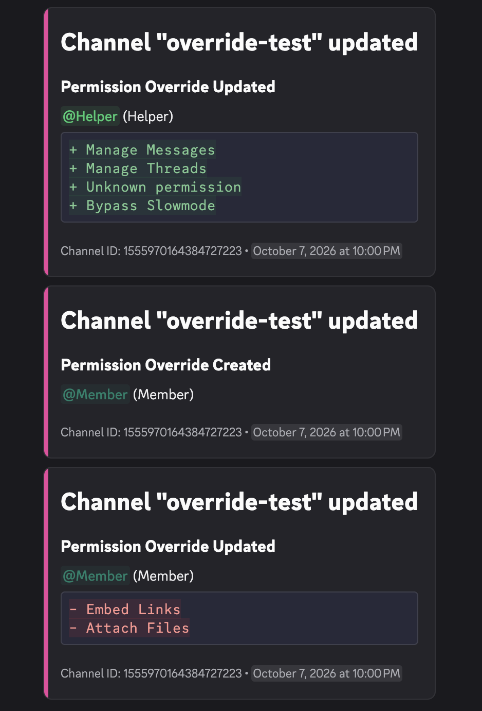
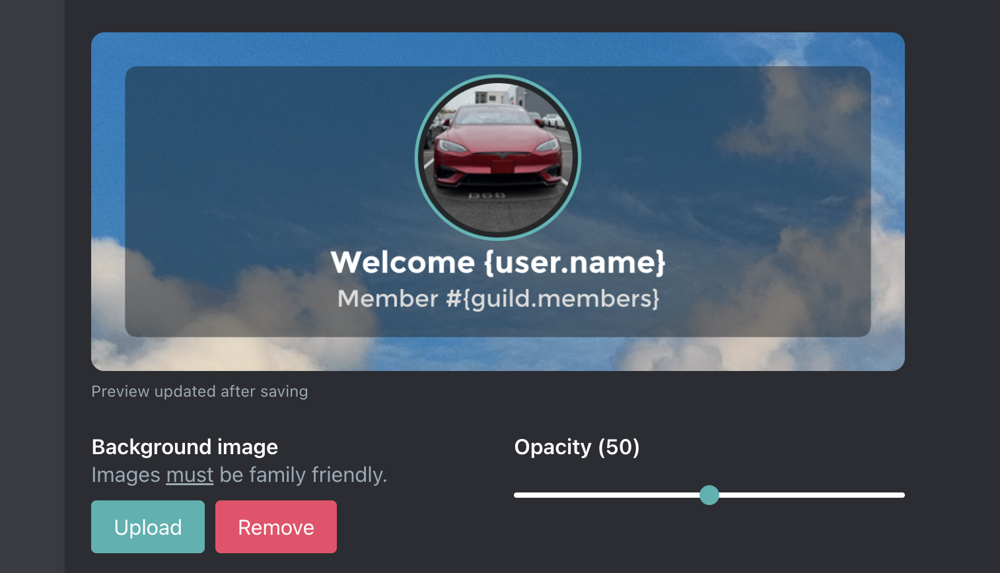

# 10-9-2026

## Various updates

### Leveling

New [tags](/plugins/leveling/setup/levelup-message#tags) are available to use in the levelup message:

- `{user.previous_level}` - The user's previous level
- `{user.next_level}` - The user's next level
- `{user.required_xp}` - The xp required to reach the next level

### /role command

Added 4 new sub commands to the `/role` command. All commands require the user to have permission to perform the action. (Must have `Manage Roles` & be above the role)

| **Command** | **Description** |
| - | - |
| `/role add` | Add a role to a member |
| `/role remove` | Remove a role from a member |
| `/role create` | Create a new role |
| `/role update` | Update an existing role |

::: tip Note
The legacy prefix/message command `!role` only supports viewing information about a role.
:::

### Logging

Changes to channel permissions are now logged if channel update is enabled. 

### Counters

Added a new counter type (Members in Voice) which tracks the total number of members in voice chat across your server.

### Welcomer

Welcome and goodbye images can now be uploaded instead of requiring an Imgur.com url. 

### Misc

- Various bug fixes
