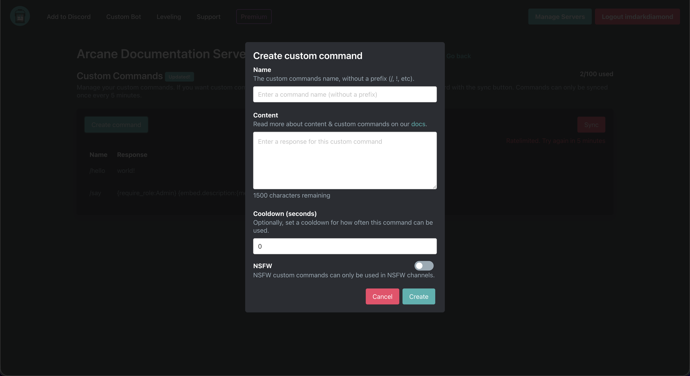

# 3-11-2026

## Custom Commands Rewrite

Custom Commands have been rewritten from the ground up. Custom commands now have more tags, support message commands, and some new configuration options were added. The custom commands dashboard has been slightly updated in this update. 



### Tag System v2

We're introducing [Tag System v2](/tag-system/reference) which includes more tags and advanced scripting.

We've added or updated the following tags: 

- `if`
- `any`
- `all`
- `args[i]`
- `target`
- `target.add_role()`
- `target.remove_role()`
- `react`
- `require_role`
- `require_channel`
- `require_user`
- `require_permission`
- `deny_role`
- `deny_channel`
- `deny_user`
- `deny_permission`
- `delete`
- `delete_reply`
- `redirect`
- `break`
- [Temporal Storage](/tag-system/reference#storage)
- `join`
- `contains`
- `replace`
- [Comments](/tag-system/reference#comments)

#### Example verify command

```
{#:Define the moderator role}
{let(moderator_role):458353820284485646}
{#:Define the role to assign}
{let(verified_role):903042161086431233}

{require_role:{moderator_role}}

{target.add_role({verified_role})}

{user.name} has verified {target.mention}. Welcome to the server. Check out <#902348151170670633>
```

Usage: `/verify target:Arcane chan` `!verify @Arcane chan`


#### Further examples

You can find more examples [here](/plugins/custom-commands/examples/index).

### Message Commands

Custom commands now support [message commands](/core/commands/settings#message-commands).

### Levelup Message

Levelup messages now include access to Tag System v2. [Embed tags](/tag-system/reference#embeds) are available to all servers. 

A premium subscription is required for some advanced tags. Learn more [here](/plugins/leveling/setup/levelup-message#advanced-tags).

### Welcomer Messages

Welcome and goodbye messages now include access to Tag System v2. [Embed tags](/tag-system/reference#embeds) are available to all servers. 

### Documentation

We have added [custom commands](/plugins/custom-commands/index) and [Tag System v2](/tag-system/reference) to our [documentation](https://docs.arcane.bot).
