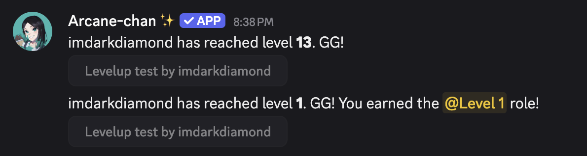
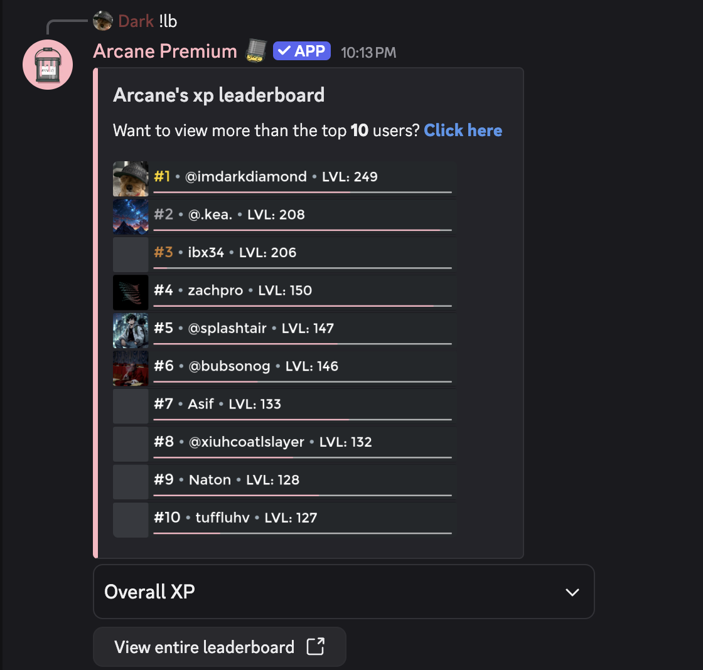

# 4-7-2025

## Leveling
- The levelup test now will send twice (one with a role assigned & one without) if you have the {earned} tag **AND** a saved role reward.

- The `/leaderboard` command includes a small progress bar for each user (like `/level`). We're just experimenting with this. Might stay, might not. Colors will change as we experiment. We'll probably do a poll in #polls at some point

- Updated some errors on the dashboard

## Logging
- Channel descriptions are now logged. Forgot to add this and nobody ever noticed until recently

## Moderation
- `/unban` will now include the moderator who unbanned a user in the moderation log msg
