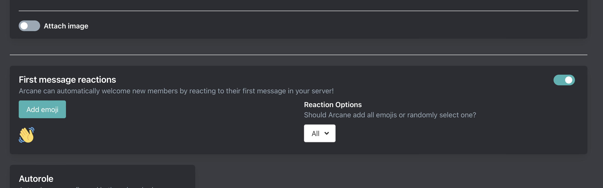
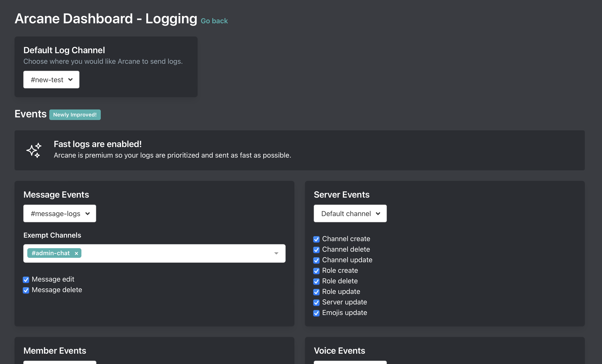

# 6-5-2023

## WELCOMER & LOGGING UPDATES

### :wave: WELCOMER :wave:

Welcoming should be more than just sending a welcome message. Today we introduce something new for the welcomer module.

- Updated dashboard UI

- Arcane can now add emojis to the welcome message! Eg automatically add the wave emoji to get some more participation in your server.
    - Free servers can choose one emoji.
    - Premium servers can choose up to 5 emojis and have arcane add them all or randomly choose one.
- Arcane can now automatically add emojis to new members first message.
    - Free servers can choose one emoji.
    - Premium servers can choose up to 5 emojis and have arcane add them all or randomly choose one.

### :police_officer: LOGGING :police_officer:

- Updated dashboard UI

- Added server logs
- Added member logs (different than welcomer plugin!)
- Added voice logs

### Other changes
- We have quite a few other changes and bug fixes in this deploy
