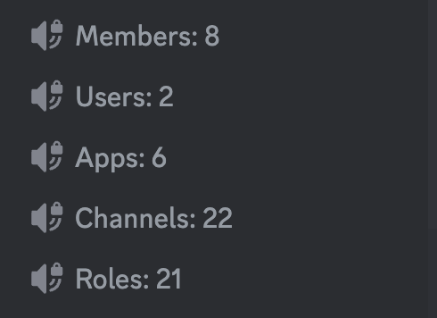
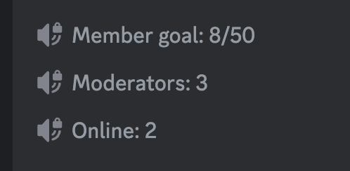
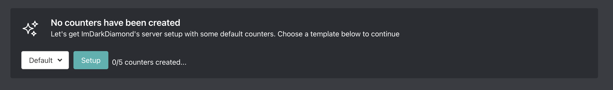

# 6-10-2024

## New plugin, logging updates, and bug fixes

### New Plugin: Counters

Counters allow you to showcase your server's statistics in your channel list using voice channels! There are currently 19 different counter types and we plan on adding quite a few more if the plugin sees decent adoption and usage.

As always everything is configured on our **[dashboard](<https://arcane.bot/dsahboard>)**. You can either get setup with the defaults or create your own.

Feel free to see some of the examples I've screenshotted below 🥰

### Counters (detailed)
- Added 18 counter types
    - Not gonna list them all here but members, users, bots/apps, channels, nitro boosts, roles, etc
- Added 1 goal counter type. More will be added (see above)
    - For now we only support member count but we will be adding more. Just wanted to ship the new plugin ;)
    - Goal counters allow you to set a list of goals and as your server grows the goal counter will automatically move onto the next goal when the current goal is reached
- Names of counters are fully configurable
- Configured via our dashboard

- You can choose to have longer numbers like 1000, 100,000, etc shortened to 1K, 100K, etc.

**IMPORTANT:** Counters are only updated every **15** to **30** **minutes** due to discord limits.

### Logging
- Arcane can now ignore a channel and ignore any updates made to it (eg name changes)

### Bug fixes
- Various
