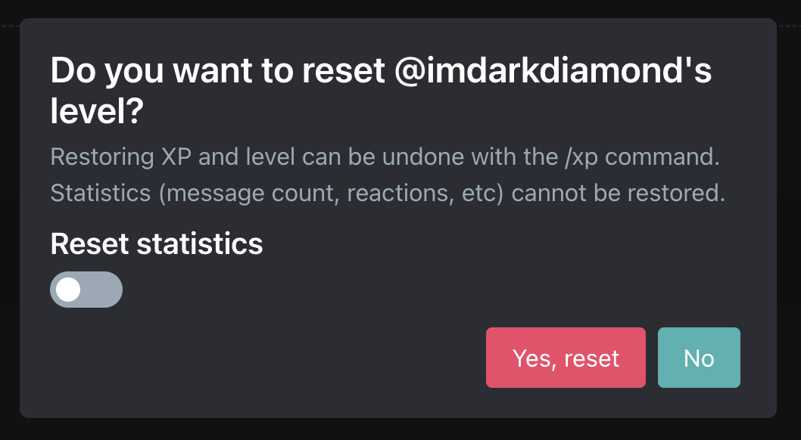

# 6-30-2025

## Leveling

### `/xp` command updates

We've added some additional configuration to the `/xp` command. These settings are **only** able to be configured by the **server owner**. The server owner will bypass these settings. Read more [here](../../plugins/leveling/setup/xp-management)

- Disable `/xp` command
- Disable xp reset

Additionally, we have added the ability to reset your server member's statistics when resetting their level. This will reset their message count, voice time, reaction count, etc.

### Role Rewards

Arcane will not assign role rewards which have elevated permissions (such as manage server or admin).

### Weekly/Monthly Highlights (Beta)

- Improved efficiency & reliability.
- They are still in beta.

## Misc

- Various bug fixes
- Upgraded to 10gig networking for faster boot times
