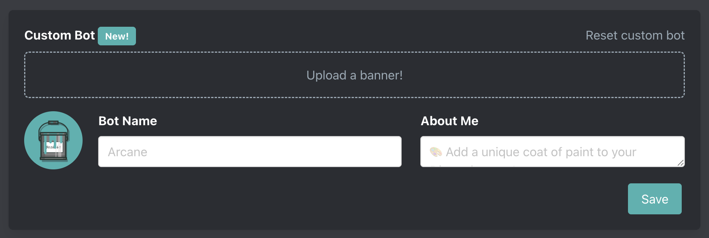

# 9-10-2025

We are excited to announce that premium servers can now customize Arcane with your own avatar, banner, name, and about me. Read more about the feature [here](/custom-bots).

<!-- TODO: Discord profile preview -->

## FAQ

### Do I need to provide a bot token?

Nope! Arcane Premium's will modify its name, avatar, and other properties for just your server. All you need to do is [invite Arcane Premium](/premium#premium-bot) & set up your custom bot!

### Does this cost more?

It depends. Over the past few years we have added many features (and have many more coming) and this is one of the highest value features we're adding. If you have an old subscription that is less than $7/mo or $75/year you will be prompted to upgrade. If you have a lifetime purchase you will be required to pay a $25 on time fee. If you are paying $7/mo or $75/year you are already eligible to use custom bots.

### Moderation

Images are moderated the same as rank card images. NSFW content is **not** allowed. See [here](/custom-bots#moderation-what-s-allowed).
