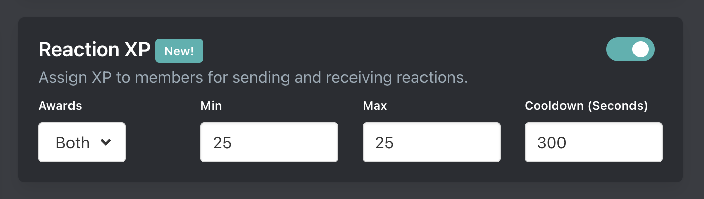

# 9-2-2025

We've added some new features to Message XP & Reaction XP.

## Message XP


You can now disable Message XP. Useful if you only want members earning xp for voice activity or reactions.

### Message XP Mode

Today we are introducing the option for Arcane to reward XP for every word in a message instead of just for an entire message. Read more about the modes [here](/plugins/leveling/setup/xp-options#message-xp-mode)

::: tip
By default Arcane will continue rewarding for entire messages but you can swap to the new **Per word** option on the [dashboard](/core/dashboard).
:::

#### Example

Example message:

```
Hello world. I'm happy to be here!
```

With the default **Random** mode, Arcane will assign 15 to 40 XP for the message.

With the new **Per word** mode, Arcane will assign 1 XP for each word. The message contains 7 words total. 4 words are valid (Hello, world, happy, here) so they would earn 4 XP. 3 words are under 3 characters so they are invalid and do not earn any XP.

## Reaction XP



When we introduced reaction XP we made the decision to only give XP to members who are adding reactions.

Now you can choose if you want the **message author**, the **member/reactor** who added the reaction, or **both** to receive XP. Read more about reaction XP [here](/plugins/leveling/setup/xp-options#reaction-xp).

::: tip
If you currently have reaction XP enabled, it will continue only giving XP to the **reactor**. You can enable rewarding the message author on the dashboard. New servers will default to **both**.
:::
