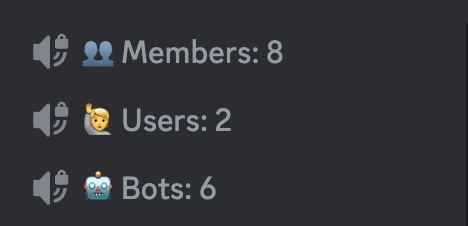
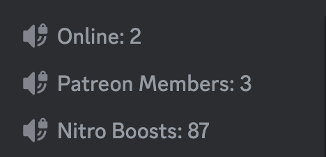
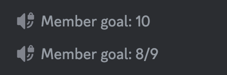

# Counters

Showcase your server's stats in style with voice channels. Quickly and easily setup counters to showcase your server's member count, bots, boosts, and more.

## Setup

- [Setup](./setup)

## Basic Counters
Setup basic counters to showcase your server's statistics!

## Advanced Counters

Track specific metrics such as Nitro boosts, members with a particular role, and online members, and more.

## Goal Counters
Use goal counters to increase engagement in your Discord server. Goals automatically update to the next goal when your server reaches the current goal!

