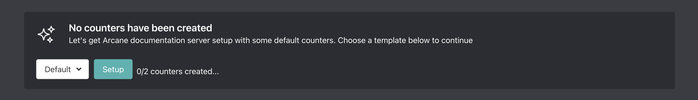

# Counters Setup

::: tip
Setup is done on the [dashboard](../../core/dashboard).
:::

## Counters

::: info
Counters update every 15 to 20 minutes if your server has recent activity
:::

### Counter Types

Arcane has 18 counter types.

- Members
- Users
- Bots/Apps
- Roles
- Channels
- Text Channels
- Voice Channels
- Category Channels
- Announcement Channels
- Stage Channels
- Members with Role
- Members without Role
- Emojis
- Nitro Boosts
- Nitro Boost Tier
- Estimated Online Members
- Estimated Offline Members
- Static

### Setup

Arcane can create 2 default counters in bulk: (Members & Users)

or you can manually create counters:

Use the `{count}` tag to indicate where the count should go.

## Goals

Goal counters are very similar to counters, but they will display the statistic milestone you want to reach. If the server reaches the goal then Arcane will automatically begin displaying the next milestone.

::: info
Goal counters update every 15 to 20 minutes if your server has recent activity
:::

### Goal Counter Types

Arcane has 6 goal counter types.

- Members
- Users
- Members with Role
- Members without Role
- Nitro Boosts
- Nitro Boost Tier

### Setup

Goals are separated by commas.

Use the `{goal}` tag to indicate where the goal should go.

(Optionally) use the `{count}` tag to indicate where the count should go.
