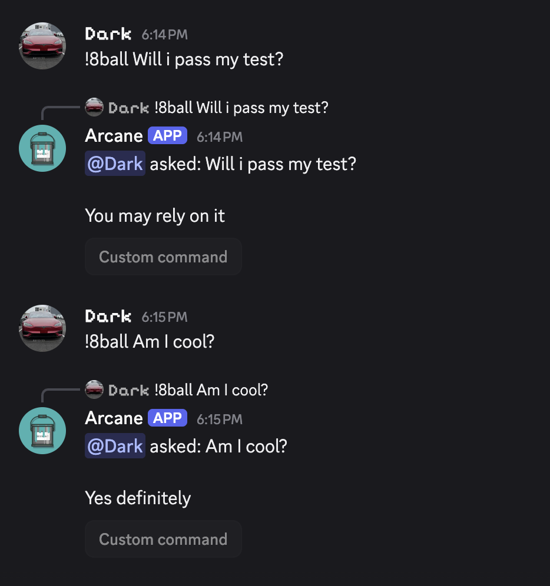

# Roll Command

A simple command which showcases using the [args](/tag-system/reference#args) and [range](/tag-system/reference#math) tags.

```
{user.mention} asked: {args}

{choose:It is certain|It is decidedly so|Without a doubt|Yes definitely|You may rely on it|As I see it, yes|Most likely|Outlook good|Yes|Signs point to yes|Reply hazy, try again|Ask again later|Better not tell you now|Cannot predict now|Concentrate and ask again|Don't count on it|My reply is no|My sources say no|Outlook not so good|Very doubtful}
```

Usage: `/8ball args:Will I pass my test` `!8ball Will I pass my test`


