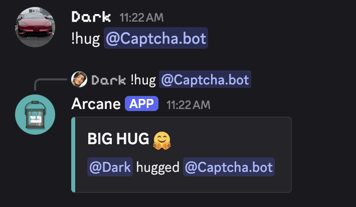

# Hug Command

A simple hug command which showcases using the [embed](/tag-system/reference#embeds) and [target](/tag-system/reference#target-member-user) tags.

```
{embed.title:BIG HUG 🤗}
{embed.description:{user.mention} hugged {target.mention}}
{embed.color:#40B2B0}
```

Usage: `/hug target:Arcane chan` `!hug @Arcane Chan`


