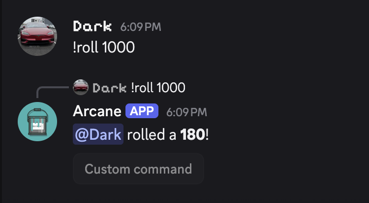

# Roll Command

A simple command which showcases using the [args](/tag-system/reference#args) and [range](/tag-system/reference#math) tags.

```
{user.mention} rolled a **{range:1|{if({args[0]}>0):{args[0]}|6}}**!
```

Usage: `/roll args:6` `!roll` `!roll 10`


