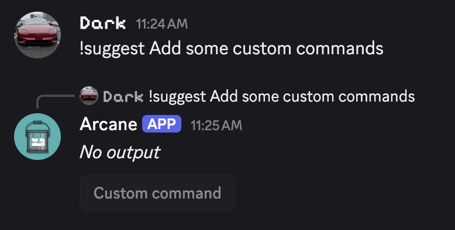
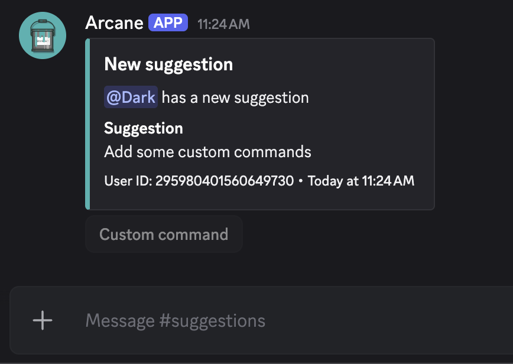

# Suggest Command

A simple suggest command which showcases using the [embed](/tag-system/reference#embeds), [args](/tag-system/reference#args), & [redirect](/tag-system/reference#behavior) tags. The user's suggestion will be sent to your #suggestions channel.

```
{redirect:suggestions}

{embed.title:New suggestion}
{embed.description:{user.mention} has a new suggestion}
{embed.field:Suggestion|{message}}
{embed.color:#40B2B0}
{embed.footer:User ID: {user.id}}
{embed.timestamp}
```

Usage: `/suggest args:Add some custom commands` `!suggest Add some custom commands`




