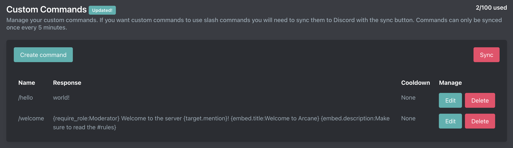

# Custom Commands Setup

::: tip
Setup is done on the [dashboard](../../core/dashboard).
:::

## Creating a custom command

<video controls="controls" src="../../images/custom-commands/create-commands.mp4" /> 

### Name

The command name should **NOT** include a prefix. So if you want to make `/hello` or `!hello` the command name is just "hello". Custom commands use your server's prefix.

### Response

Responses can utilize our [tag system](/tag-system/reference). See some of our example commands [here](./examples/index).

### Cooldown

The cooldown limits how often the custom command can be ran by a single user. A cooldown is not necessary. 

### NSFW

::: danger DANGER
Failing to enable this risks server **blacklist** for violating Arcane and Discord ToS.
:::

If a custom command outputs NSFW content, enable the **NSFW toggle**. This will restrict the command to NSFW-marked channels only.  

### Limits

| **Tier** | **Total CC** |
| - | - |
| Free | 5 |
| Premium | 100 |

## Sync commands

You can sync commands to your Discord server by using the "Sync commands" button. This will instruct Arcane to create the slash commands in your server. 

## Updating a custom command

Updating a command is done on the same page as creating a custom command.

You cannot change the name of a command after it is created. You will need to make a new command and delete the previous command if you need to rename a command.

## Deleting a custom command

Deleting a command is done on the same page as creating a custom command. Please note that deleting a command cannot be undone so save your responses in case you need them in the future.
