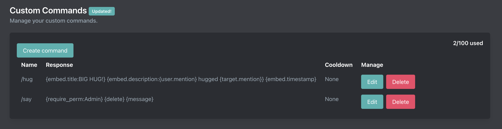

# Custom Commands Setup

::: tip
Setup is done on the [dashboard](../../core/dashboard).
:::

## Creating a custom command

You can create a custom command on the [dashboard](../../core/dashboard).

The command name should **NOT** include a prefix. So if you want to make `/hello` or `!hello` the command name is just "hello". Custom commands use your server's prefix.

Responses can utilize our [tag system](/tag-system/tags). See some of our example commands [here](./examples/index).

TODO:
<!-- <video controls="controls" src="../../images/custom-commands/create-command.mp4" /> -->

### Limits

| **Tier** | **Total CC** |
| - | - |
| Free | 5 |
| Premium | 100 |

## Updating a custom command

Updating a command is done on the same page as creating a custom command.

You cannot change the name of a command after it is created. You will need to make a new command and delete the previous command if you need to rename a command.

## Deleting a custom command

Deleting a command is done on the same page as creating a custom command. Please note that deleting a command cannot be undone so save your responses in case you need them in the future.
