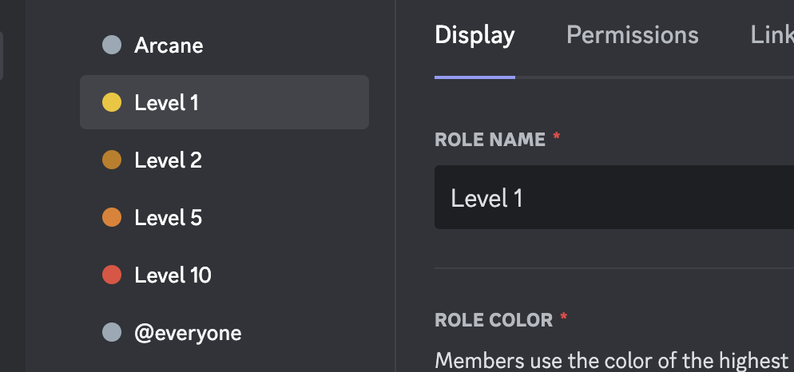

# Leveling

Arcane's leveling plugin incentivizes your members to participate in your server. Reward your members for different types of activity by auto assigning role rewards.

## XP Sources

Depending on your server's configuration Arcane can award XP for the following activity:

- Messages
- Voice
- Reactions
- Manual (with the `/xp` command)

## Rewards

Arcane can automatically assign your members roles for their activity.

## Leaderboards

Arcane has multiple leaderboards for your member's to climb:

- Overall XP & Level
- Voice Time
- Reactions
- Weekly XP
- Monthly XP

## Rank Cards

View more about rank card configuration [here](./card.md).
