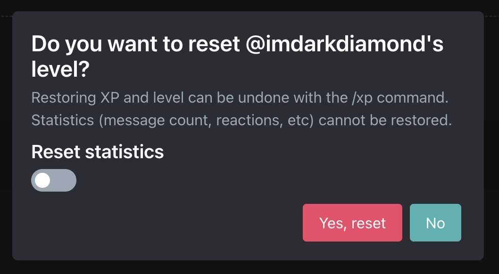

# XP/Level Management

## Max level VS `/xp` limit

### Max Level

The max level members can organically earn. You can configure this yourself on the [dashboard](./setup/xp-options#max-level) to any value (or no value for unlimited).

### `/xp` limit

:::tip
[Premium](../../premium) servers can request an increase [in our support server](https://discord.gg/arcane) to this value if there are multiple people who have organically leveled up to around the current limit.
:::

The max level you can set with the `/xp` command. The default is **100**.

`/xp add`, `/xp set xp`, and `/xp set level` will not work for members higher than the `/xp` limit.

`/xp` is limited to **prevent abuse**. No, you are not cool by setting yourself to level 1 million just so you're rank #1.

## `/xp` Command

The `/xp` command is available for you to manage your members xp & level values.

| **Sub-command** | **Explanation** |
| - | - |
| `/xp add` | Add XP to a member |
| `/xp remove` | Remove XP from a member |
| `/xp set xp` | Change the XP progress for a member's current level |
| `/xp set level` | Change the level for a member |
| `/xp reset server` | Reset the XP and level of everyone in the server |
| `/xp reset member` | Reset the XP and level of a member |

## Resetting statistics

::: danger DANGER
Resetting statistics CANNOT be undone
:::

By default, when resetting levels and xp, Arcane will not reset statistics (messages, reactions, voice time, etc). If you would like these to be reset you can toggle reset stats when running `/xp` or when on the online leaderboard.

## Resetting members who have left

::: tip
Arcane can automatically reset members who leave your server with the [Auto reset](./setup/leaderboard#auto-reset) setting.
:::

To reset the XP & level of a member who has left the server you will need to go to the online leaderboard.

<video controls="controls" src="../../images/leveling/reset-left-member.mp4" />
