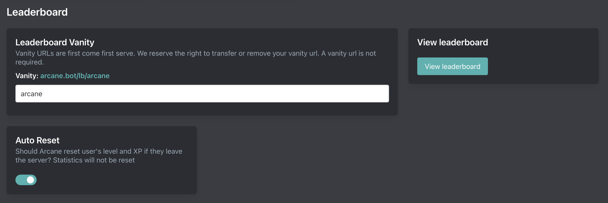

# Leaderboard

::: tip
Setup is done on the [dashboard](../../../core/dashboard).
:::

## Vanity URL

A vanity url will shorten your leaderboard. Vanities are first come, first serve. Only put the vanity in the form.

`https://arcane.bot/lb/437808333295058955` -> `https://arcane.bot/lb/vanity`

For example, Arcane's official discord server has the vanity `arcane`. Our leaderboard is available at https://arcane.bot/lb/arcane instead of https://arcane.bot/lb/437808333295058955

## Auto Reset

Arcane can reset levels and XP of members who leave (or get removed from) your server.
