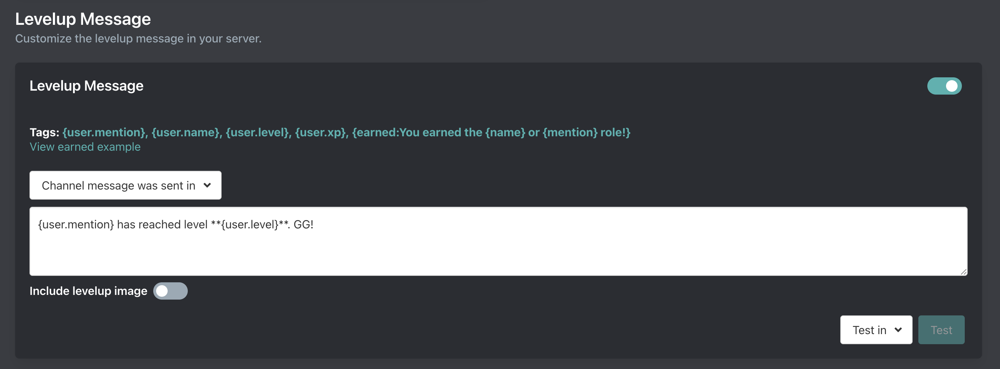

# Levelup Message

::: tip
Setup is done on the [dashboard](../../../core/dashboard).
:::



## Levelup Message

### Channel

Arcane can send the levelup message in the channel where the member earned the XP or in a channel of your choice. If you don't want a levelup message then disable the setting altogether.

### Message

Default message:

```
{user.mention} has reached level **{user.level}**. GG!
```

#### Tags

Tags can be used inside of the levelup message.

##### User
- `{user.mention}` - Mentions the user
- `{user.username}` `{user.name}` - The username of the member
- `{user.id}` - The id of the member

##### Image
- `{image}` - Alternative for the "include levelup image" toggle.

We recommend just using the toggle but if you want it only send with the `{earned}` tag then you can use the `{image}` tag.

##### Earned

- `{earned:text when member earns a role reward}`
- `{name}` - Name of the role reward. Only available inside of `{earned}`
- `{mention}` - Display the role reward. (Will not ping) Only available inside of `{earned}`

The earned tag seems very complicated, but, it's not.

The earned tag is for including the role reward which the member earned. If the member did not earn a reward then the entire tag is excluded.

<details>
	<summary>View examples:</summary>

::: info Example
Let's say you have a role reward at level 5. Let's say its name is "Active members".

Your levelup message is set to:
```
{user.mention} is now level {user.level}. {earned:They received the **{name}** role!}
```

You just leveled up to level 3. Here's the levelup message that will send:

```
@ImDarkDiamond is now level 3.
```

You then leveled up to level 5. Here's the levelup message:

```
@ImDarkDiamond is now level 3. They received the **Active members** role!
```
:::
</details>

#### Embeds

The levelup message supports embeds. See [Embeds](/tag-system/tags#embeds).

#### Advanced tags

::: tip Premium only
Advanced tags require a [Premium subscription](/premium.md)
:::

Levelup messages also support **most** [advanced tags](/tag-system/index) such as:
- [`{if()...}`](/tag-system/tags#conditionals)
- [`{contains()...}`](/tag-system/tags#arrays)
- [`{choose:one|two|three}`](/tag-system/tags#choose)
- and more

Role management tags are not supported in levelup messages. Use [Role Rewards](./role-rewards)

### Levelup image

Arcane can send a small levelup graphic. There are no customization options available at this time.


### Testing

You can test your levelup message every few minutes. Select a channel you want the test to be sent in and Arcane will send a fake levelup message.

If you have the `{earned}` tag in your levelup message and a saved role reward then it will send two levelup messages. One with a reward and one without a reward.
