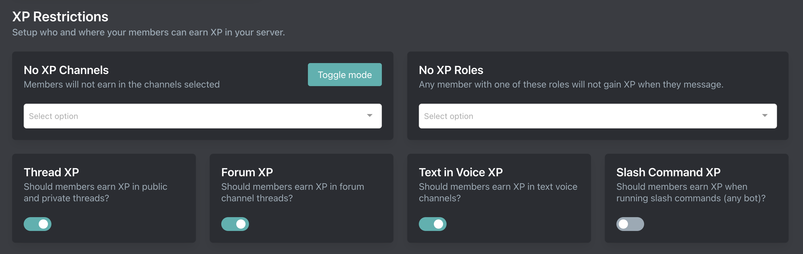

# XP Restrictions

::: danger
XP Restrictions being misconfigured is our largest support item. Read the documentation **VERY CAREFULLY** because if misconfigured your members **WILL NOT EARN XP**. See [debugging](../debugging)
:::

Setup is done on the [dashboard](../../../core/dashboard).

## (No) XP Channels

**No XP channels** works as a **blacklist**. Members will **not** earn any XP in the channels selected.

**XP channels** works as a **whitelist**. Members will **only** earn XP in the channels selected.

## No XP Roles

Members with one or more no XP role will not earn any XP

## Thread XP

Enables (or disables) if members will earn XP for sending messages in threads

## Forum XP

Enables (or disables) if members will earn XP for sending messages in forum threads

## Text in Voice XP

Enables (or disables) if members will earn XP for sending messages in voice channels

## Slash Command XP

Enables (or disables) if members will earn XP for running slash commands (of any bot)
