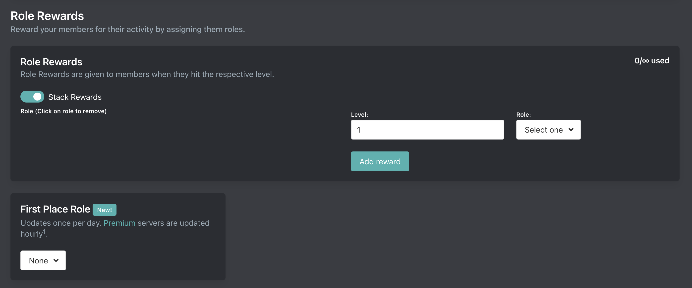

# Role Rewards

::: tip
Setup is done on the [dashboard](../../../core/dashboard).
:::

## Role Rewards

Role Rewards are assigned when members reach a particular level.

### Update Frequency

Arcane only assigns role rewards when member's levelup or when they run the `/level` command. Arcane will never retroactively apply role rewards to fix permission errors or add new role rewards to existing members. Discord does not want bots mass assigning roles.

### Limits

| **Tier** | **Total Role Rewards** | **Role Rewards per level** |
| - | - | - |
| Free | 15 | 1 |
| Premium | ∞ | 3 |

### Stack Rewards

If stack rewards is enabled then Arcane will assign all role rewards which the member qualifies for. If disabled then the member will only get the highest role reward they qualify for and the rest will be removed.

## First Place Role

Arcane can assign a role to the member with the highest level in your server.

| **Tier** | **Update Frequency** |
| - | - |
| Free | 24 hours |
| Premium | 1 hour |
