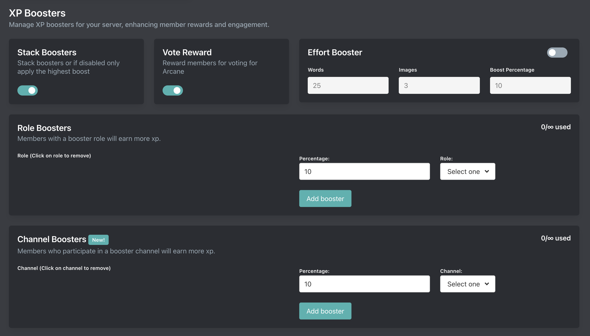

# XP Boosters

Setup is done on the [dashboard](../../../core/dashboard).

## Stack Boosters

If stack boosters is enabled then members boosts will be combined when they earn any XP. If disabled then Arcane will only apply the members highest XP boost.

	
View examples:

::: info Example
Let's say you have the following config:
- Vote Booster: 10%
- Role booster: Favorite members get 25%

Let's assume the member who is earning XP has voted & has the Favorite members role.

If stack boosters is **enabled** then they will get a **35%** XP boost. If **disabled** then they will only get a **25%** XP boost.
:::

## Vote Reward

::: tip Premium only
Disabling requires a [Premium subscription](/premium.md). Voting helps advertise and grow Arcane
:::

Members can vote for Arcane on qualifying bot lists to earn a 12 hour 10% XP boost.

## Effort Booster

The effort booster will reward members with more XP for:
- Longer messages
- Images

## Role Boosters

Members with a booster role will earn more xp.

| **Tier** | **Total Role Boosters** |
| - | - |
| Free | 1 |
| Premium | ∞ |

## Channel Boosters

Members who participate in a booster channel will earn more xp.

| **Tier** | **Total Channel Boosters** |
| - | - |
| Free | 1 |
| Premium | ∞ |
