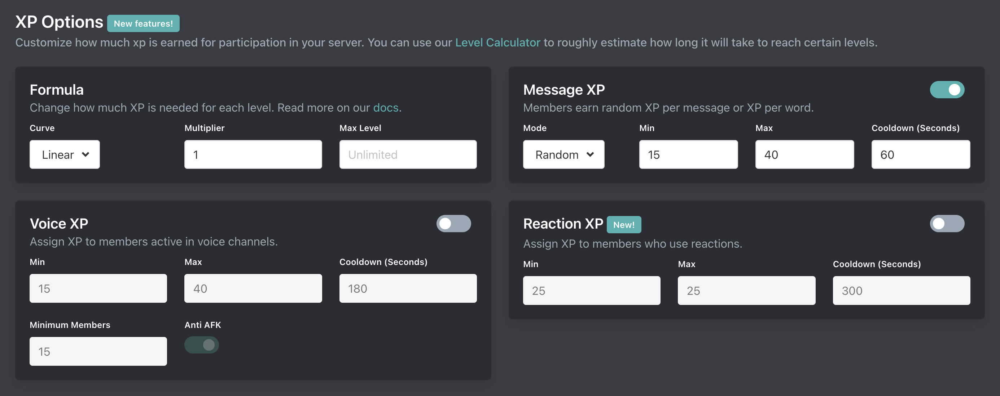

# XP Options

::: tip
Setup is done on the [dashboard](../../../core/dashboard).
:::

## Formula

### Curve

Arcane currently offers 3 curve options:

| **Name** | **Formula** |
| - | - |
| Linear (default) | `(level * 100) + 75` |
| Exponential | `5 * (level^2) + (level * 50) + 75` |
| Flat/Constant | `1000` |

### Multiplier

The multiplier is used to modify the formula. `Formula * Multiplier`

	
View examples:

::: info Example
Let's say you are using the Constant formula which requires exactly 1000 xp for every level.

| **Multiplier** | **Required XP for all levels** |
| - | - |
| 1 | 1000 * 1 = 1000 |
| 5 | 1000 * 5 = 5000 |
| 10 | 1000 * 10 = 10000 |
| 0.5 | 1000 * 0.5 = 500 |

Or if you're using the Linear formula:

| **Multiplier** | **Required XP for level 10** |
| - | - |
| 1 | (10 * 100) + 75) * 1 = 1075 |
| 5 | ((10 * 100) + 75) * 5 = 5375 |
| 10 | ((10 * 100) + 75) * 10 = 10750 |
| 0.5 | ((10 * 100) + 75) * 0.5 = 537.5 = 538 |
:::

### Max Level

The max level is the max level which your members are able to earn. If none is set then members can earn an unlimited amount of XP and levels.

## XP Options

All XP sources have the following settings. Some XP sources have additional settings documented below.

| **Setting** | **Explanation** |
| - | - |
| Min | The minimum amount of XP members will earn |
| Max | The maximum amount of XP members will earn |
| Cooldown | This is how often (in seconds) members can earn for the XP source |

### Message XP

Arcane can reward members XP for sending messages in your servers. By default Arcane rewards per message. The default cooldown is **1 minute**.

#### Message XP Mode

Arcane offers two Message XP Modes:

- **Random**: Awards random XP between min and max per message. The default mode.
- **Per Word**: Awards max XP per word (3+ characters) in a message with more words/characters than whitespace/non-alphanumeric characters. Min and max XP are automatically set equal.

### Reaction XP

Arcane can reward members XP for reacting to messages with reactions. By default reaction xp has a **5 minute** cooldown.

#### Awards

Arcane can reward members for **receiving reactions** on their message, for **adding reactions** to messages, or **both**. The cooldown for getting XP for adding and receiving reactions are shared.

### Voice XP

::: tip Premium only
Voice XP requires a [Premium subscription](/premium.md) & the Premium bot in your server
:::

Arcane can reward members XP for participating in your voice channels. The default cooldown is **3 minutes**.

#### Minimum Members

This is the amount of members that need to be in a single voice channel for voice XP to start awarding XP.

::: info
Arcane only considers a member to be active and in the voice channel if they are unmuted and not deaf. This is because Arcane does not join the voice channel. This would limit voice XP to one voice channel, be expensive to run, and a privacy nightmare.
:::

#### Anti AFK

Arcane automatically starts to lower how much XP is given to members after they have been in a voice channel for multiple hours in one session. If you want members to earn an unlimited amount of XP in one session you can disable the anti afk feature.
