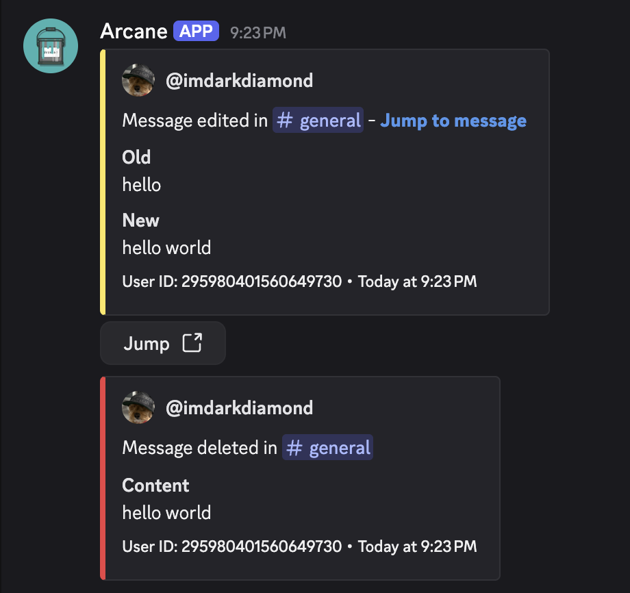
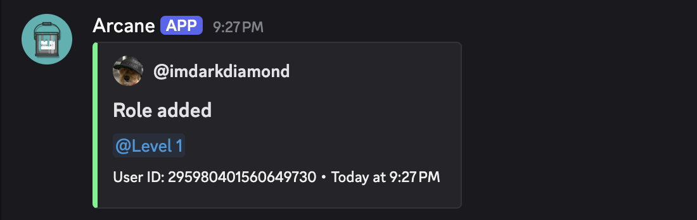
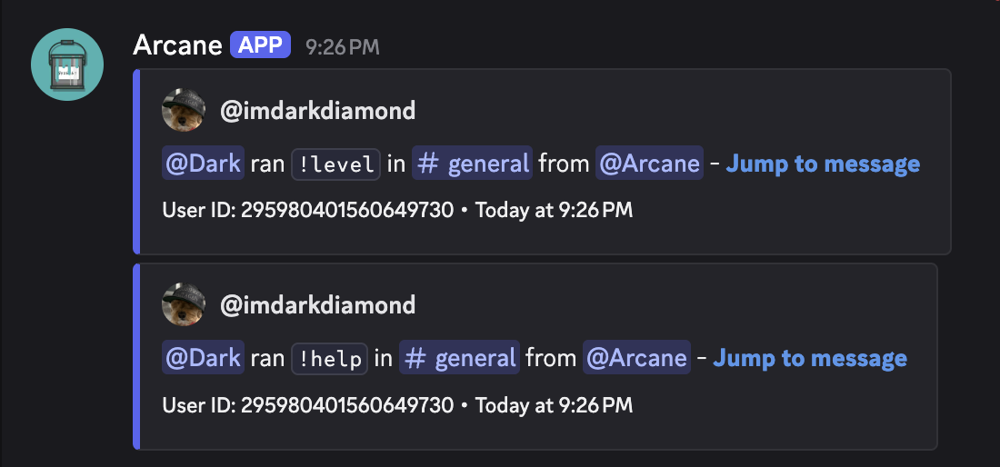

# Logging

Arcane can send your server's audit log (and more) to channels of your choice.

## Setup

- [Setup](./setup)

## Message Logs

Log messages which are deleted or edited.

## Server Logs

Log name changes, channels, roles, emojis, stickers, and more.

## Member Logs

Log joins, leaves, and role changes.

## Voice Logs

Log voice channel joins, leaves, swaps, and more.

## Command Logs

Log commands which are ran by Arcane or other bots.

