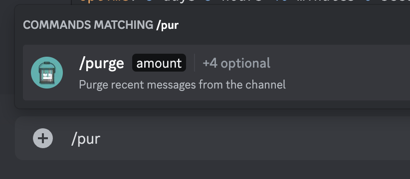
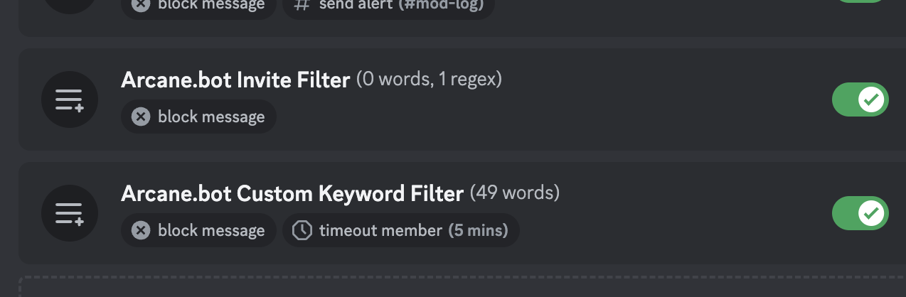

# Moderation

Keep your Discord server free from spam, swearing, and more with Arcane's Auto Moderation rules. Additionally, use Arcane to track bad behavior and let your moderators take action.

## Setup

- [Setup](./setup)

## Moderation Commands

See the full list of Moderation commands on the [commands page](../../core/commands/list.md#moderation)

## Auto Moderation

Setup Auto Moderation which is built ontop of Discord AutoMod.

