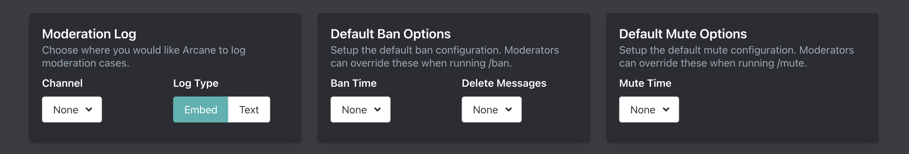
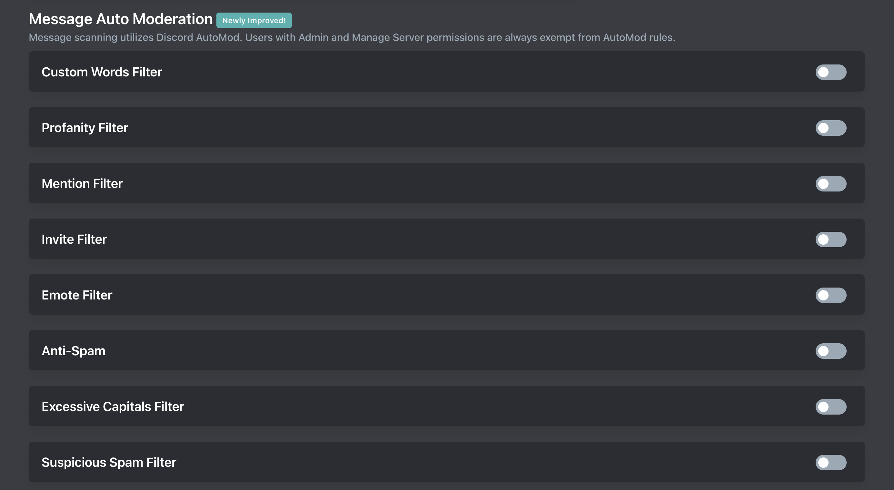

# Moderation Setup

## Command Settings

Please refer to [command settings](../../core/commands/settings) for restricting command usage.

## General Settings

::: tip
Setup is done on the [dashboard](../../core/dashboard).
:::

### Moderation Log

Arcane will log mutes/timeouts, kicks, and bans in this channel. Arcane logs actions moderators take with Arcane's commands, other bots commands, or through the Discord UI.

#### Channel

Choose where you would like Arcane to send logs.

#### Type

Arcane can send logs in an embed or text format.

### Default Ban Options

#### Ban Time

Choose how long Arcane will ban someone for if a time is not provided. This is useful if you do not want to permanently ban members from your server.

#### Delete Messsages

Choose how many messages you would like Arcane to remove when banning members.

### Default Mute Options

#### Mute Time

Choose how long Arcane will mute someone for if a time is not provided.

## Auto Moderation

::: tip
Setup is done on the [dashboard](../../core/dashboard).
:::

Arcane builds upon Discord AutoMod to automatically prevent certain messages from being sent in your server.

### Creating AutoMod Rules

Some AutoMod filters have required settings. Make sure you click into the filter and fill out the required fields.

A punishment and log channel are optional but nice to have.

<video controls="controls" src="../../images/moderation/automod-filter-setup.mp4" />

### Removing AutoMod Rules

::: tip
Sometimes Arcane will not remove the filter so you will need to go into your Discord server settings (desktop only) -> safety setup -> AutoMod. If you're on mobile you can disable it by using the Discord web app: https://discord.com/app
:::

You can disable the AutoMod filter on the [dashboard](../../core/dashboard).

### Filter Types

#### Custom Words Filter

The Custom Words Filter is used to block specific words or phrases. Reference [Discord documentation](https://support.discord.com/hc/en-us/articles/4421269296535-AutoMod-FAQ#h_01GV3HBH7412D01VKF9EKHEMA2) for tips on how to format.

#### Profanity Filter

The Profanity Filter blocks obscence profanity in your server. Including but not limited to, profanity, slurs, and sexual content. The list of profane words is managed by Discord.

If you want to block more or less then use the Custom Words Filter.

#### Mention Filter

Block messages which contain a large amount of mentions (@everyone, @here, roles, and members).

#### Invite Filter

The Invite Filter blocks members in your server from posting invites to other servers. By default this also blocks invites to your server so make sure to whitelist your invites.

Invites should be in the format `discord.gg/invite`

#### Emote Filter

The Emote Filter blocks members from sending messages with tons of emotes.

#### Anti-Spam

Prevent members from sending many messages in a short period. We recommend 5 messages every 4 to 5 seconds.

#### Excessive Capitals Filter

The Excessive Capitals Filter blocks messages which contain a large amount of capital letters (60% or more). Only removes messages with 5 or more characters.

#### Suspicious Spam Filter

The Suspicious Spam Filter will block messages containing suspected spam and phishing links. The list of spam and phishing links is managed by Discord.
