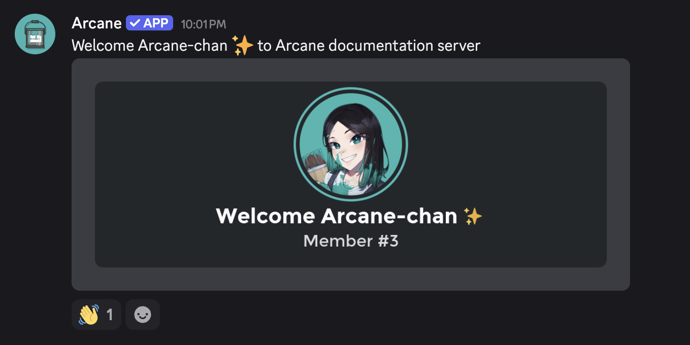

# Welcomer

Arcane's welcomer plugin can be used to greet and log members who leave your server. You may also be interested in the [logging](../logging/index.md) plugin if you just want logs for moderation purposes.

## Setup

- [Setup](./setup)

## Features

### Welcome Messages

Welcome your newest member in style with an automated message. Arcane can also generate and upload an image to add some extra flair.

### Goodbye Messages

Log members who have left your server :(

### First message reactions

Arcane can react to member's first message (with 1 or more reactions). This will prompt other members to welcome them to your server.

