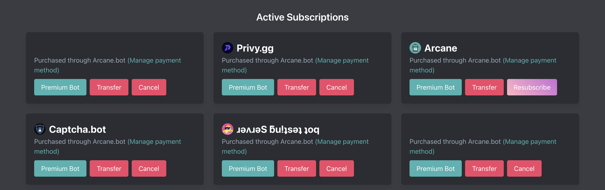

# Premium

Premium allows us to pay for hosting, salaries, and other required expenditures to run Arcane for over 2,300,000 million Discord servers. Unfortunately, running large real time services is not cheap. Development and support is more than a full time commitment.

Our website also serves ads to help with operational costs. Please feel free to use an ad blocker to remove them if you don't like advertisements.

## Pricing

Premium perks are **$7** per discord server. For the most accurate pricing and feature list please visit https://arcane.bot/premium.

## Feature list

| **Feature** | **Free** | **Premium** |
| - | - | - |
| **Basic** |
| Basic features and config | Yes | Yes |
| **Voice Leveling** |
| Voice leveling/xp | No | Yes |
| Custom voice XP values | No | Yes |
| **Leveling** |
| Message leveling/xp | Yes | Yes |
| Custom XP values | No | Yes |
| Reaction leveling/XP | Yes | Yes |
| Custom reaction XP values | No | Yes |
| Custom level images | No | Yes |
| Role rewards | 15 | ∞ |
| Role rewards per level | 1 | 3 |
| First place role updates | Daily | Hourly |
| Booster roles | 1 | ∞ |
| Booster channels | 1 | ∞ |
| Disable vote booster | No | Yes |
| Leaderboard banner | No | Yes |
| Weekly leaderboards | Yes | Yes |
| Monthly leaderboards | No | Yes |
| Weekly/Monthly notifications | Image | Image |
| /xp restrictions lifted | No | By request1 |
| **Moderation** |
| Moderation plugin | Yes | Yes |
| **Counters** |
| Total counters | 3 | ∞ |
| Basic counters | Yes | Yes |
| Advanced counters | No | Yes |
| Goal counters | No | Yes |
| **Logging** |
| Message logs | 1 hour | 12 hours |
| Advanced voice logs | No | Yes |
| Fast logs | No | Yes |
| **Welcomer** |
| Custom background | No | Yes |
| Welcomer colors | No | Yes |
| Welcomer message reactions | 1 | 10 |
| First message reactions | 1 | 10 |
| **Roles** |
| Reaction roles | 10 | 100 |
| **Youtube Notifications** |
| Youtube Alerts | 2 | 52 |
| **Custom Commands** |
| Custom commands | 5 | 100 |

1. Only available to subscriptions which are not in trial
 
2. Additional Youtube alerts can be purchased. Read more <a href="./plugins/youtube#limits">here</a>

Last updated: July 31st, 2025

## Activation

Premium is activated immediately (can take up to 5 minutes) after purchase.

## Premium Bot

::: info
The premium bot is not automatically added to your Discord server
:::

You can invite the Premium Bot to your server on your server's [dashboard](https://arcane.bot/dashboard) page or on the [premium purchase](https://arcane.bot/premium) page under "Active subscriptions."

### Do I need to keep the normal bot?

It depends. If you purchased premium through https://arcane.bot/premium then you can remove the normal bot after you invite the premium bot. If you purchased premium through the [Discord client](https://discord.com/discovery/applications/437808476106784770/store) then you will need to keep the normal bot in your server.

## Transferring

You can transfer your premium subscription to a new server one time on the [dashboard](https://arcane.bot/premium) under "Active subscriptions."

Unfortunately, we are unable to transfer your subscription from one Discord account to another. You will need to cancel and resubscribe on your new account.

## Canceling

You can cancel your premium subscription on the [dashboard](https://arcane.bot/premium) under "Active subscriptions." or by emailing `contact@privy.gg`.

## Terms / Refunds

[Terms & Refund Policy](https://privy.gg/legal)
